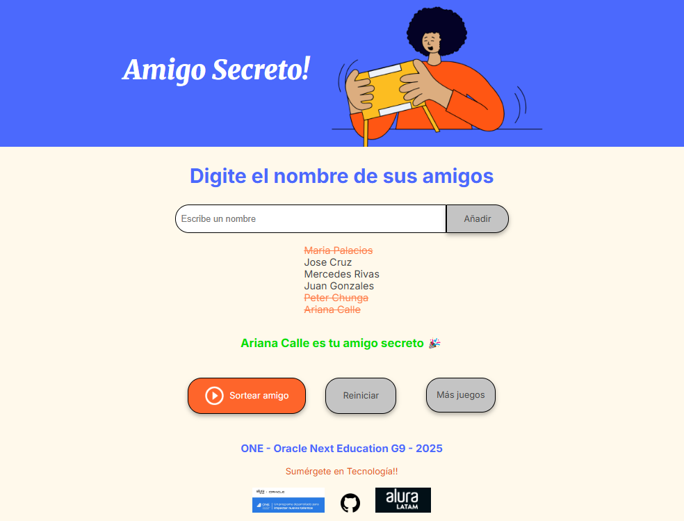

# Alura-Oracle-Next-Education-G9-Challenge-Amigo-Secreto
# 🎁 Aplicación Amigo Secreto

Aplicación para ingresar nombres en una lista y luego realizar un sorteo aleatorio para elegir al "amigo secreto".  

## [👉 Ver la aplicación en Vercel](https://challenge-amigo-secreto-g9.vercel.app/)

<p align="center">
  
</p>


---

## ✨ Funcionalidades  (Validaciones en proceso -.-)

- Agregar participantes a una lista
- Validación para evitar nombres duplicados o vacíos
- Sorteo aleatorio que asigna a cada participante un "amigo secreto"
- Interfaz simple, intuitiva y responsiva

---

## 🚀 Cómo usar

1. Accede a la [aplicación desplegada](https://challenge-amigo-secreto-g9.vercel.app/)
2. Ingresa los nombres de todos los participantes
3. Haz clic en “Realizar sorteo”
4. Descubre quién es el amigo secreto de cada uno 🎉

---

## 🛠️ Tecnologías utilizadas

- HTML5
- JavaScript
- CSS
- Vercel (para el deploy)

---
## ✨ Resumen de las funcionalidades implementadas

| Paso | Acción                         | ¿Dónde se implementa?       | Descripción                                                                 |
| ---- | ------------------------------ | --------------------------- | --------------------------------------------------------------------------- |
| #1   | **Capturar nombre**            | `agregarAmigo()` (`app.js`) | Se obtiene el valor del campo de entrada con `getElementById`.              |
| #2   | **Validar entrada vacía**      | `agregarAmigo()`            | Se usa `if` para comprobar si el nombre está vacío y se muestra un `alert`. |
| #3   | **Agregar al array**           | `agregarAmigo()`            | Se usa `.push()` para añadir el nombre al arreglo `listaDeAmigos`.          |
| #4   | **Limpiar campo de entrada**   | `agregarAmigo()`            | Se limpia el campo `input` asignando `""` a su `.value`.                    |
| #5   | **Declarar el array global**   | `app.js` (inicio)           | Se crea `let listaDeAmigos = []` para almacenar los nombres.                |
| #6   | **Obtener lista del HTML**     | `mostrarListaDeAmigos()`    | Se usa `getElementById("listaAmigos")` para acceder a la lista `<ul>`.      |
| #7   | **Limpiar la lista existente** | `mostrarListaDeAmigos()`    | Se usa `lista.innerHTML = ""` para borrar los elementos actuales.           |
| #8   | **Iterar sobre el array**      | `mostrarListaDeAmigos()`    | Se recorre `listaDeAmigos` con un bucle `for`.                              |
| #9   | **Agregar elementos `<li>`**   | `mostrarListaDeAmigos()`    | Se crea un `<li>` por cada amigo y se añade con `.appendChild()`.           |
| #10  | Validar que haya amigos        | `sortearAmigo()`            | Se verifica que `listaDeAmigos` no esté vacío antes de sortear.             |
| #11  | Generar índice aleatorio       | `sortearAmigo()`            | Se usa `Math.random()` y `Math.floor()` para generar un número válido.      |
| #12  | Obtener el nombre sorteado     | `sortearAmigo()`            | Se accede al elemento del array en la posición aleatoria.                   |
| #13  | Mostrar el resultado           | `sortearAmigo()`            | Se actualiza contenido del elemento con ID `resultado` usando `innerHTML`.  |

---

## 📦 Instalación local (opcional)

Si deseas clonar y ejecutar localmente:

```bash
git clone https://github.com/tu-usuario/amigo-secreto.git
cd amigo-secreto
npm install
npm run dev

