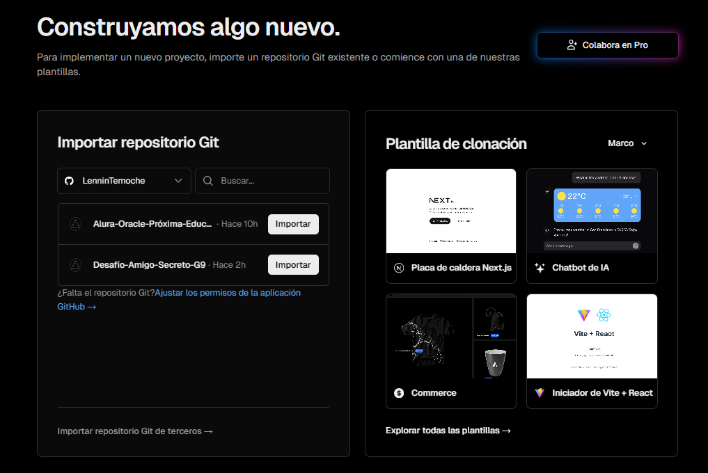

# Alura-Oracle-Next-Education-G9-Challenge-Amigo-Secreto
# 🎁 Aplicación Amigo Secreto

Aplicación para ingresar nombres en una lista y luego realizar un sorteo aleatorio para elegir al "amigo secreto".  

## [👉 Ver la aplicación en Vercel](https://challenge-amigo-secreto-g9.vercel.app/)

<p align="center">
  
</p>


---

## ✨ Funcionalidades 

- Agregar participantes a una lista.
- Validación para evitar nombres duplicados o vacíos.
- Validación para ingresar sólo texto.
- Sorteo aleatorio que asigna a cada participante un "amigo secreto".
- Interfaz simple, intuitiva y responsiva.

---

---

## 🚀 Cómo usar

1. Accede a la [aplicación desplegada](https://challenge-amigo-secreto-g9.vercel.app/)
2. Ingresa los nombres de todos los participantes
3. Haz clic en “Realizar sorteo”
4. Descubre quién es el amigo secreto de cada uno 🎉

---

## 🛠️ Tecnologías utilizadas

- HTML5
- JavaScript
- CSS
- Vercel (para el deploy)

---

## 👉 Despliegue de la aplicación en Vercel

<p align="center">
  
</p>

### Pasos para el despliegue en Vercel 
- Vercel se integra directamente con GitHub para facilitar el despliegue. Inicia sesión o registrate en  https://vercel.com/new
- Importa tu proyecto en Vercel:
  - Haz clic en el botón "Add New Project" (Agregar nuevo proyecto).
  - Selecciona el repositorio de GitHub que contiene tu proyecto.
  - Configura la implementación.
  - Vercel detectará automáticamente la configuración necesaria para tu proyecto.
- Haz clic en el botón "Deploy" (Implementar).
- Vercel construirá y desplegará tu proyecto en una URL única.
¡Listo! Tu proyecto estará en vivo y accesible a través de la URL proporcionada por Vercel.

- Si prefieres puedes optar por el despligue en GitHub Pages [Paso a Paso para activar tu proyecto en GitHub Pages](https://www.aluracursos.com/blog/github-pages)
- Encuentra más información sobre el despliegue en Vercel en [Heroku, Vercel y otras opciones de cloud como plataforma](https://www.aluracursos.com/blog/heroku-vercel-y-otras-opciones-de-cloud-como-plataforma)

---

## ✨ Funcionalidades 

- Agregar participantes a una lista.
- Validación para evitar nombres duplicados o vacíos.
- Validación para ingresar sólo texto.
- Sorteo aleatorio que asigna a cada participante un "amigo secreto".
- Interfaz simple, intuitiva y responsiva.

---

## ✨ Resumen de las funcionalidades implementadas

| Paso | Acción                         | ¿Dónde se implementa?       | Descripción                                                                 |
| ---- | ------------------------------ | --------------------------- | --------------------------------------------------------------------------- |
| #1   | **Capturar nombre**            | `agregarAmigo()`            | Se obtiene el valor del campo de entrada con `getElementById`.              |
| #2   | **Validar entrada vacía**      | `agregarAmigo()`            | Se usa `if` para comprobar si el nombre está vacío y se muestra un `alert`. |
| #3   | **Agregar al array**           | `agregarAmigo()`            | Se usa `.push()` para añadir el nombre al arreglo `listaDeAmigos`.          |
| #4   | **Limpiar campo de entrada**   | `agregarAmigo()`            | Se limpia el campo `input` asignando `""` a su `.value`.                    |
| #5   | **Declarar el array global**   | `app.js`               | Se crea `let listaDeAmigos = []` para almacenar los nombres.                |
| #6   | **Obtener lista del HTML**     | `mostrarListaDeAmigos()`    | Se usa `getElementById("listaAmigos")` para acceder a la lista `<ul>`.      |
| #7   | **Limpiar la lista existente** | `mostrarListaDeAmigos()`    | Se usa `lista.innerHTML = ""` para borrar los elementos actuales.           |
| #8   | **Iterar sobre el array**      | `mostrarListaDeAmigos()`    | Se recorre `listaDeAmigos` con un bucle `for`.                              |
| #9   | **Agregar elementos `<li>`**   | `mostrarListaDeAmigos()`    | Se crea un `<li>` por cada amigo y se añade con `.appendChild()`.           |
| #10  | Validar que haya amigos        | `sortearAmigo()`            | Se verifica que `listaDeAmigos` no esté vacío antes de sortear.             |
| #11  | Generar índice aleatorio       | `sortearAmigo()`            | Se usa `Math.random()` y `Math.floor()` para generar un número válido.      |
| #12  | Obtener el nombre sorteado     | `sortearAmigo()`            | Se accede al elemento del array en la posición aleatoria.                   |
| #13  | Mostrar el resultado           | `sortearAmigo()`            | Se actualiza contenido del elemento con ID `resultado` usando `innerHTML`.  |
| #14	 | Reiniciar lista	              | `reiniciarLista()`	        | Limpia array, HTML y resultado.                                             |
| #15	 | Validar nombres duplicados	    | `agregarAmigo()`	          | Usa .some() para evitar repetidos (ignora mayúsculas).                      |
| #16	 | Validar solo texto	            | `agregarAmigo()`	          | Usa expresión regular para permitir solo letras.                            |
| #17	 | Activar tecla Enter            | `addEventListener("keydown")`|	Escucha Enter y ejecuta agregarAmigo().                                   |
---

## 🛠️ Instalación en local 

Si deseas clonar y ejecutar localmente:

```bash
# 1. Clona el repositorio
git clone https://github.com/LenninTemoche/Challenge-Amigo-Secreto-G9.git
# 2. Entra al directorio del proyecto
cd Challenge-Amigo-Secreto-G9
# 3. Instala las dependencias
npm install
# 4. Inicia el servidor de desarrollo
npm run dev
```

---

## 📁 Estructura del proyecto

```text
challenge-amigo-secreto_esp-main/
├── index.html              # Página principal del juego
├── style.css               # Estilos del juego
├── app.js                  # Lógica del juego en JavaScript
├── README.md               # Instrucciones de la aplicación
└── assets/                 # Carpeta de imágenes
    ├── amigo-secreto.png
    ├── play-circle-outline.png new-proyect-vercel.png
    ├── new-proyect-vercel.png        # Vista previa nuevo proyecto en Vercel
    └── challenge-amigo-secreto.png   # Vista previa del juego en Readme
```
---

🧠 Objetivo del proyecto

Este proyecto fue creado con el objetivo poner en práctica los conocimientos  adquiridos en 1ra etapa de formación Lógica de Programación con JavaScript, del programa ONE - Oracle Next Education G9.
Está disponible para fines educativos, puedes modificarlo libremente.

---

📝 Notas

Asegúrate de tener todas las imágenes en la carpeta assets/.
El juego es completamente funcional sin necesidad de servidor o dependencias externas.
Ideal para practicar lógica de programación y manipulación del DOM JavaScript.

---

✨ Créditos

Desarrollado como ejercicio de Challenge Amigo Secreto, del programa ONE - Oracle Next Education G9.

---

